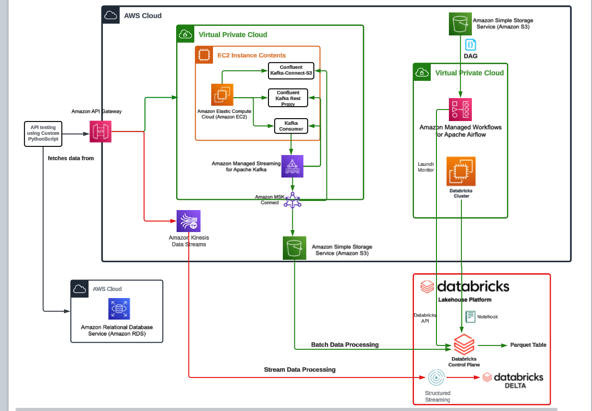
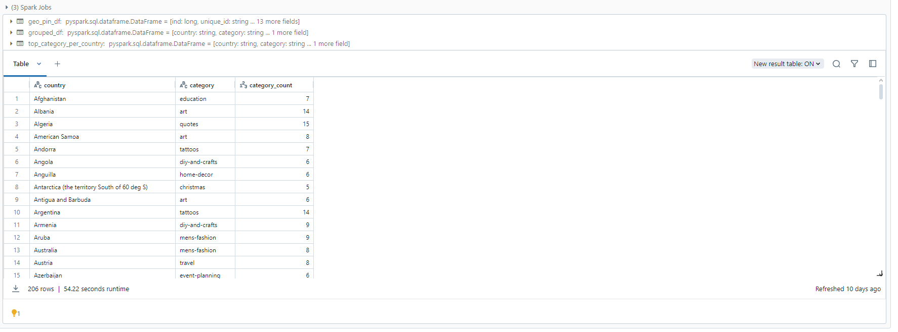
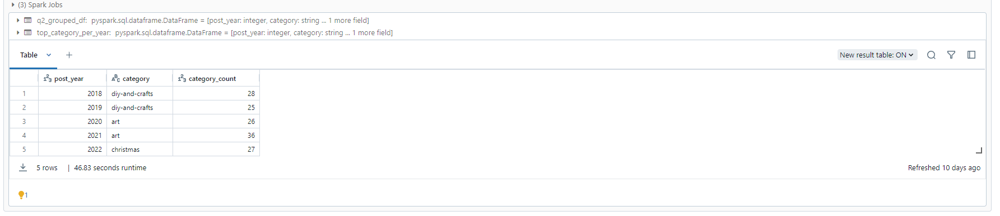
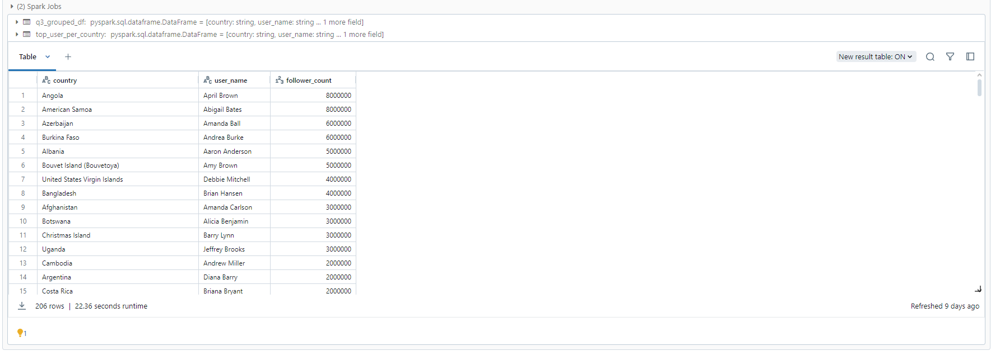
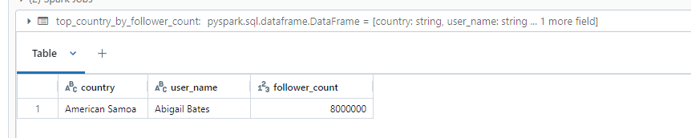
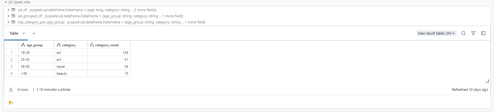
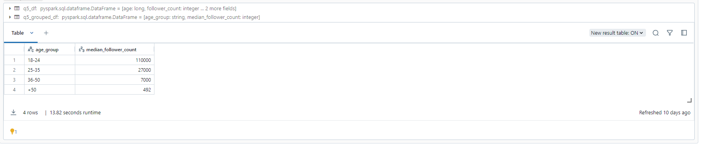
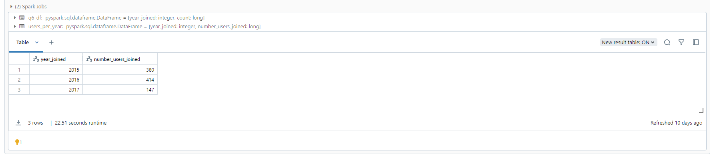
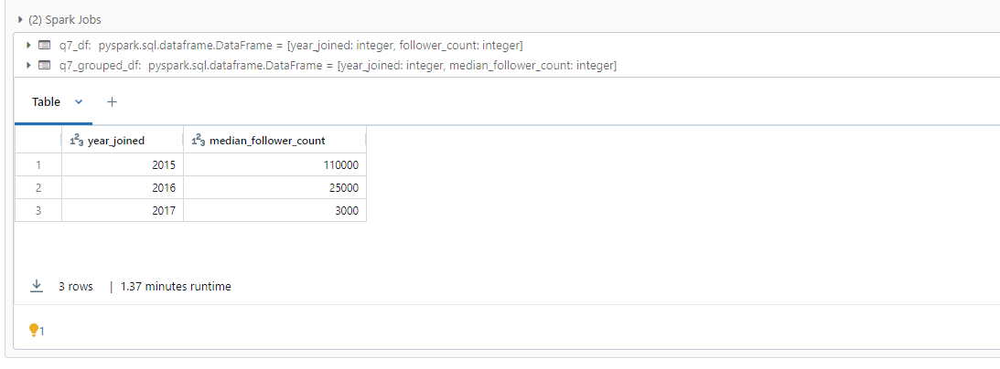
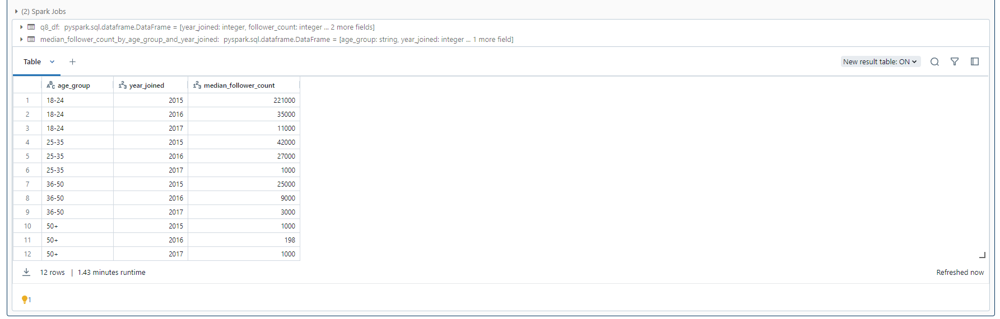

# Pinterest Data Pipeline

## Table of contents

1. [The Scope](#the-scope)
2. [Overview](#overview)
3. [What it does](#what-it-does)
4. [What I used](#what-i-used)
5. [What I learned](#what-i-learned)
6. [Instructions](#instructions)

## The Scope
Pinterest crunches billions of data points every day to decide how to provide more value to their users. In this project, you'll create a similar system using the AWS Cloud.

## Overview 

## What I used
#### AWS
Most of this project is built on AWS. Heres a list of the services used
- EC2
- S3
- IAM
- MSK + MSK connect
- Kinesis
- API Gateway

#### Databricks
Along with the AWS Through this project I have used databricks to import, manage, clean and perform analytical queries on the data.
The structure I have followed is to have a notebook for the initial configurations including mounting the S3 bucket with the data in. Next I have 3 seperated notebooks to clean each of the three data tables. \
For my Kinesis streaming I have used 1 notebook to initialise and clean the streams and then send the data to 3 Delta Tables

## How it works
### Step 1 - Configurations
Here is a UML diagram covering how the data flows in this project \

The main data flow is generated from the user_posting_emulation.py which is a script that emulates a person posting on Pinterest. This pushes data to 3 tables, a pinterest table with post details, a geo table with location details and a user table with user data. This all flows to an S3 bucket. 

### Step 2 - The Notebooks
I have split my code into 5 notebooks. The first is the configurations + setup notebook. This simply mounts the data from the S3 bucket into databricks. Next is the 3 data cleaning notebooks. Each of these takes the data from the tables and cleans it to get it all standardised. \
The final notebook is the queries notebook. This is the most important one which runs the 3 data cleaning notebooks and then answers a series of question by grouping and filtering the data. Below are screenshots of the questions answered with example data.

#### Q1 - Find the most popular category in each country

#### Q2 - Find which was the most popular category each year. Find how many posts each category had between 2018 - 2022

#### Q3 - Find the user with the most followers in each country
I have split this question into two queries. The first part, shown below, is to find the top user and follower count per country.

Next i narrowed this down to find the top country based on the above query

#### Q4 - Top category per age group

#### Q5 - Median follower count per age group

#### Q6 - Find how many users have joined each year

#### Q7 - Find the median follower count of users based on their joining year

#### Q8 - Find the median follower count of users based on their joining and age group

### Step 3 - Kinesis 
The next step to this project is working with AWS kinesis to emulate the flow of streaming data. I created a new script called user_posting_emulation_streaming.py which is an adaptation of the first posting script. This time however it pushes the data to different kinesis streams. These three streams are then loaded into databricks where the same cleaning process that was used for the batch data processing is used and then the data is pushed to delta tables within databricks. 

## My experience while doing this project 
### Chapter 1 - The Setup
The setup for this project was a long process to link all the AWS softwares and get them to talk to each other. \
From installing kafka and the other necessary modules onto the EC2 machine to even setting up the key pairs to be able to connect to the EC2 machine.\
I faced a couple issues when doing the setup, including not allowing proxy on my HTTP any request but issues were quickly resolved to the point the data now flows through to the S3 bucket as it should. \
Whilst the setup for this style of pipeline is fiddly in terms of having lots of locations for different config files and settings, once you get the hang of where to look and which configs are for which service it becomes very clear and very efficient in terms of time taken to setup. 

### Chapter 2 - Databricks
During this step I have setup my Databricks account and linked through to the AWS S3 bucket with my data that has been pushed from my user posting emulation. \
Databricks is very easy to use and being able to swap between languages means changing schemas etc in sql then switching back to python is incredible easy.\
Overall using the databricks notebooks for was incredibly easy. Learning spark was a whole new language but I translated it across from my knowledge of both SQL and pandas. 

### Chapter 3 - MWAA
MWAA is the AWS platform for managing Airflow. Airflow is used to automate tasks on a schedule that you set and control and allows for graceful error management on the tasks. \
During this project I used MWAA to run the queries notebook on a daily schedule. This is to emulate batch processing of data. \
The setup using MWAA is much easier than using airflow directly with all the necessary things configured out the box in MWAA.

### Chapter 4 - Kinesis + API gateway
Kinesis is an AWS platform to manage streaming data. The configuration for Kinesis itself is very simple and self explanitory however if you are using API gateway for an API to be able to push the data to it, the setup becomes extremely convoluted and long. Whilst i understand the process and the steps it took to set it all up i find the whole way of configuring things in API gateway to be very non friendly. From things such as not being able to move or change child/parent relationships to having things such as the method type and the http method being different things (yet so similarly named and little in app descriptions for them). Other than these small issues i had with the setup once it is configured the data flows extremely easily from my script through to where I loaded it into databricks.